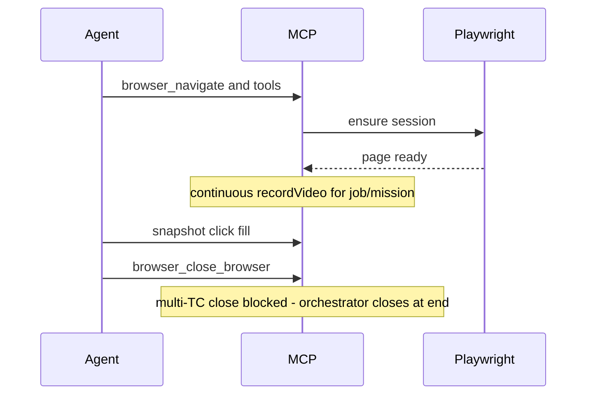

# Otomasi Browser

---

## Pendahuluan

Dokumen ini menjelaskan otomasi **browser** di Knitto Agent Automation: Playwright session, MCP tools, semantic locator, dan rekaman video.

---

## Tujuan Dokumen

- Menjelaskan lifecycle browser session per job
- Mendokumentasikan strategi locator dan recording
- Menjadi acuan saat menambah tool `browser_*`

---

## Ruang Lingkup

Mencakup: session, tools, locator, recording, cleanup.

Tidak mencakup hybrid orchestrator (`hybrid.md`) atau MCP transport (`mcp.md`).

---

## 1. Komponen

| Komponen | Path |
|----------|------|
| Session / interactions | `apps/backend/src/platforms/browser/driver/` |
| MCP tools | `apps/backend/src/platforms/browser/tools/` |
| MCP stdio entry | `apps/backend/src/platforms/browser/mcp-stdio-server.ts` |
| Config | `apps/backend/src/platforms/browser/config.ts` |

---

## 2. Lifecycle



Reconnect antar proses MCP (Cursor stdio): CDP endpoint di state file → `chromium.connectOverCDP`.

---

## 3. Semantic locator

Agent **tidak** diarahkan memakai CSS selector rapuh. Prefer:

- Ref dari snapshot (`e12`, …)
- `role` + `name` (aksesibilitas)
- Label / placeholder / teks terlihat

---

## 4. Recording

| Mode | Mekanisme | Output |
|------|-----------|--------|
| Single job | Playwright `recordVideo` + ffmpeg 1.5× | `recording.mp4` |
| Multi-TC / mission | **Satu** continuous video (bukan per-TC) | `recording.mp4` |
| Kartu TC | Screenshot PNG saja | `tc-NN-*.png` |

- `AUTOMATION_HEADLESS=true` di Windows sering jelek — lokal: `false`
- Env: `AUTOMATION_RECORD_VIDEO`, `AUTOMATION_FFMPEG_PATH`, `AUTOMATION_RECORD_FPS`, `AUTOMATION_VIDEO_SPEED` (default `1.5`), `AUTOMATION_VIDEO_TRIM_IDLE` (default `true`, butuh ffmpeg). Multi-TC mission: **satu sesi browser** per job (buka sekali, tutup di akhir); video kontinu `recording.mp4`; frame diam dikurangi via ffmpeg post-process.
- Chromium: `npx playwright install chromium` atau `PLAYWRIGHT_CHROMIUM_EXECUTABLE_PATH`

---

## 5. Memory

Tools `browser_get_app_memory` / `browser_update_app_memory` → API Data (token job) atau disk fallback. Prefer upsert section.

### Flow replay playbook (FLOW-REPLAY)

Section memory dapat menyertakan blok ` ```playbook ` (JSON): precondition + steps MCP + `{{variables}}`. Orchestrator (`core/flow-replay/`) selalu mencoba replay sebelum agent jika UI cocok. Detail: [plans/plan-flow-replay.md](plans/plan-flow-replay.md).

---

## 6. Cleanup

- Single-TC: agent wajib close browser di akhir (prompt)
- Multi-TC: agent **dilarang** close; `cleanupJobPlatforms` memanggil `browser_close_browser` (finalize video)

Katalog lengkap tool MCP browser: [mcp.md §2](mcp.md#2-browser-mcp--tools-terdaftar).

---

## 7. Power tools native (inspeksi & state)

Delapan tool yang memberi kapabilitas di luar interaksi/observasi UI, semuanya memakai **objek `Page`/context Playwright yang sama** dengan tool `browser_*` lainnya — jadi **dijamin same-page**, tanpa subprocess, dan otomatis tersedia di kedua runtime (Cursor + OpenAI) dan kedua transport (in-process + stdio).

| Tool | Playwright API | Guna |
|------|----------------|------|
| `browser_evaluate` | `page.evaluate()` | baca nilai DOM/JS tak terlihat di snapshot |
| `browser_get_console_logs` | `page.on('console'/'pageerror')` | tangkap error JS diam-diam |
| `browser_wait_for_response` | `page.waitForResponse()` | verifikasi call API sukses (status + body) |
| `browser_get_requests` | `page.on('response')` | inspeksi call API + status |
| `browser_get_cookies` / `browser_set_cookies` | `context.cookies()` / `addCookies()` | inspeksi/seed sesi |
| `browser_save_storage_state` / `browser_load_storage_state` | `context.storageState()` / `addCookies`+`addInitScript` | **skip login** antar run |

**Implementasi:** collector console/network pasif ada di `driver/observability.ts` (buffer bounded 1000, di-*reset* tiap job saat browser baru di-launch, di-attach di `bindOpenPage`). Evaluate/cookies/storage di `driver/page-state.ts`. Tool tipis di `tools/*.ts`, terdaftar di `registry.ts` + `in-process-mcp-client.ts`.

**Catatan**
- `browser_load_storage_state` menerapkan cookie **langsung**; localStorage di-seed lewat `addInitScript` sehingga **baru aktif setelah navigasi** berikutnya — panggil sebelum `browser_navigate`.
- `browser_evaluate` menjalankan JS bebas di halaman (wajar untuk QA app internal). Untuk interaksi UI tetap pakai `browser_click`/`browser_fill` — bukan `evaluate`.
- Tool ini **selalu aktif** (bagian dari toolset standar). Kalau jumlah tool di context ingin ditekan, bisa digating via env di kemudian hari.
