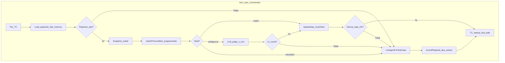

# Flow Replay Memory

> **Plan ID:** `FLOW-REPLAY`  
> **Depends on:** `MCP`, `AGENT`  
> **Unlocks:** Hemat token pada flow berulang; regression lebih cepat tanpa loop LLM per langkah

---

## 1. Masalah

Memory agent saat ini ([features.md](../features.md) §7) berupa **markdown narasi** yang dibaca LLM lewat `browser_get_app_memory` / `mobile_get_app_memory`. Isi memory masuk **history model** setiap run → boros token meski flow sama (login, buka menu, dll.).

**Target:** memory menyimpan **playbook eksekusi** (precondition + urutan tool MCP + placeholder `{{var}}`). Jika UI **cocok** → orchestrator replay via MCP **tanpa** loop agent; jika **beda** → agent LLM explore ulang dan perbarui playbook.

---

## 2. Arsitektur



### Komponen

| Komponen | Lokasi | Peran |
|----------|--------|-------|
| Schema playbook | `packages/shared/src/protocol/flow-playbook.ts` | Kontrak JSON v1 |
| Parser | `apps/backend/src/core/flow-replay/parse-playbook.ts` | Ekstrak blok ` ```playbook ` dari section memory |
| Loader | `apps/backend/src/core/flow-replay/load-playbook.ts` | Baca memory disk / API Data |
| Matcher | `apps/backend/src/core/flow-replay/match-precondition.ts` | Programmatic: URL, mustHave, activity |
| LLM judge | `apps/backend/src/core/flow-replay/llm-judge.ts` | 1 turn jika ambiguous |
| Replay runner | `apps/backend/src/core/flow-replay/replay-runner.ts` | `mcpClient.callTool` per step |
| Recorder | `apps/backend/src/core/flow-replay/record-playbook.ts` | Simpan playbook setelah agent sukses |
| Entry | `apps/backend/src/core/flow-replay/try-flow-replay.ts` | Dipanggil orchestrator sebelum agent |

---

## 3. Format memory (dual)

Section existing `## [sectionKey]` di file memory per appId. Satu section = notes manusia + blok playbook mesin.

````markdown
## [tc-01-login]

```playbook
{
  "version": 1,
  "platform": "browser",
  "precondition": {
    "urlIncludes": "/login",
    "mustHave": [
      { "role": "textbox", "name": "Email" },
      { "role": "button", "name": "Login" }
    ]
  },
  "variables": ["email", "password"],
  "steps": [
    {
      "tool": "browser_fill",
      "args": {
        "locator": { "role": "textbox", "name": "Email" },
        "value": "{{email}}"
      }
    },
    {
      "tool": "browser_click",
      "args": { "locator": { "role": "button", "name": "Login" } }
    }
  ]
}
```

Catatan QA: halaman login kadang redirect ke SSO.
````

**Aturan:**
- Jangan simpan ref `e1` — hanya locator semantik (`role`, `name`, `label`, `text`, `placeholder`)
- Mobile: `platform: "mobile"`, precondition `package` / `activityIncludes`, tools `mobile_*`
- Section key default: `defaultSectionKeyForTestCase(tc)` dari prompt-builder

---

## 4. Schema playbook v1

Lihat [`flow-playbook.ts`](../../packages/shared/src/protocol/flow-playbook.ts).

| Field | Deskripsi |
|-------|-----------|
| `version` | `1` |
| `platform` | `browser` \| `mobile` |
| `precondition` | Syarat UI sebelum replay |
| `variables` | Nama placeholder `{{key}}` |
| `steps` | `{ tool, args }[]` — nama tool MCP resmi |

### Precondition browser

| Field | Contoh |
|-------|--------|
| `urlIncludes` | `/login` |
| `mustHave` | `[{ role, name?, text? }]` |

### Precondition mobile

| Field | Contoh |
|-------|--------|
| `package` | `com.example.app` |
| `activityIncludes` | `.MainActivity` |
| `mustHave` | `[{ text?, contentDesc?, resourceId? }]` |

---

## 5. Hybrid match

1. **Programmatic** — bandingkan snapshot vs precondition:
   - `match`: semua `mustHave` ketemu (contains, case-insensitive)
   - `mismatch`: < 50% mustHave ketemu atau URL/package jelas beda
   - `ambiguous`: di antara keduanya
2. **LLM judge** (jika kredensial OpenAI-compatible tersedia):
   - Input ringkas: URL, 20 elemen inViewport, ringkasan precondition
   - Output: `match` \| `mismatch`
3. Tanpa kredensial judge → `ambiguous` diperlakukan sebagai `mismatch` → fallback agent

---

## 6. Variabel dinamis

`{{email}}`, `{{password}}`, dll. di-resolve dari `tc.variables` saat replay. Placeholder yang tidak terisi → replay gagal → fallback agent.

---

## 7. Tool whitelist v1

**Browser:** `browser_navigate`, `browser_fill`, `browser_click`, `browser_click_at`, `browser_wait_for`, `browser_scroll`, `browser_select_option`, `browser_upload_file`, `browser_press_key`, `browser_assert_text`, `browser_assert_visible`, `browser_take_screenshot`, `browser_hover`, `browser_go_back`, `browser_go_forward`

**Mobile:** `mobile_launch_app`, `mobile_tap`, `mobile_tap_at`, `mobile_input_text`, `mobile_scroll`, `mobile_wait_for`, `mobile_upload_file`, `mobile_assert_visible`, `mobile_take_screenshot`, `mobile_press_key`

---

## 8. Fallback & failure modes

| Kondisi | Aksi |
|---------|------|
| Tidak ada playbook di section | Agent penuh |
| Parse playbook invalid | Agent penuh |
| Precondition mismatch | Agent penuh |
| Step replay error | Agent penuh |
| Replay sukses | Skip agent; ringkasan singkat |

---

## 9. Dampak token

| Skenario | Perkiraan |
|----------|-----------|
| TC berulang + precondition match | ~80–95% hemat LLM |
| TC baru / UI beda | Sama seperti sekarang (full agent) |
| Setelah auto-record | Run berikutnya berpotensi fast path |

---

## 10. Fase implementasi

| Fase | Isi |
|------|-----|
| 0 | Dokumentasi (file ini + cross-links) |
| 1 | Schema shared + parser + loader |
| 2 | match-precondition + llm-judge |
| 3 | resolve-variables + replay-runner |
| 4 | Hook orchestrator |
| 5 | Recorder setelah agent sukses |
| 6 | Tests + manual verify |

---

## 11. Kriteria selesai

- Docs ter-link dari README / roadmap / TODO
- Browser + mobile replay dengan variabel dinamis
- Hybrid match + fallback agent
- Auto-record setelah agent sukses (OpenAI in-process path)
- `pnpm --filter @knitto/backend test` hijau
